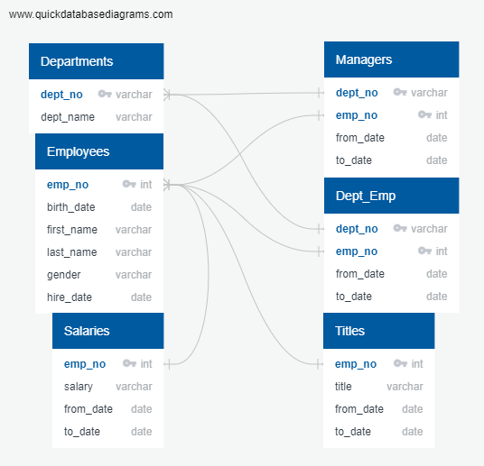
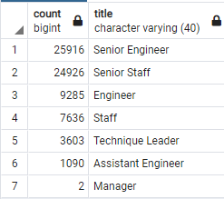
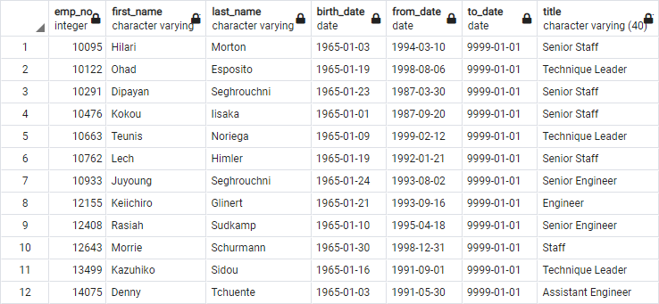

# Pewlet_Hackard_Analysis
## Overview of the analysis:
Pewlet Hackard as a company has fallen behind in their employee database. The company has employed an HR analyst to conduct workforce research; namely in preparation for the wave of incoming retirements dubbed the "Grey Tsunami". As baby boomers begin to reach retirement age Pewlet Hackard realized the need to research who among their worforce will be retiring in the near future. In order to 'future-proof' their workforce, it is important to identify the job openings they will need to fill in the future to maintain their current workforce numbers. 
Pewlet Hackard (or "PH" hencefourth) currently uses excel and VBA to work with their employee data, which is stored in six separate .csv files. PH wants to update their methods by using SQL to build an employee database using the employee data from the .csv files. Once the data is properly concatinated we are tasked with using our data modeling, engineering, and analysis skills to provide insight as to the scale and depth of the coming wave of retirements. The final product of the analysis will be an exact determination of the number of retiring employees per title, and a list of employees that are eligible to participate in the new employee mentorship program; in addition to meeting the previously stated needs.

### Methods:
The employee data .csv files are analyzed to find commonaities (Primary Keys/Foreign Keys) that can be used to join the data in a cohesive way. These commonalities are then mapped using a relational model to highlight the ways in which each .csv is related to another. The data is then imported from the six .csv files and converted into databases using Postgres and pgAdmin, with the previously generated relational model acting as the underlying framework (see fig. 1). From this point onward the data is cleaned, joined, manipulated, and analyzed using pgAdmin to accomplish the goals set by PH. The following are the results of this analysis. 

*Above: fig. 1*

## Results: 

The results of the employee data analysis for determining the number of retiring employees by title *(see fig. 2)* and the number of retiring employees that are eligible for the mentorship program *(see fig. 3 for the top 12 results of the dataframe)* are as follows: 

 *left: fig. 2 / Below: fig. 3* 

### Results: Important Take-Aways from the Data
* The results from fig. 2 show a disproportional amount of impending retirements in senior positions within PH. The disproportionality is highlighted when a comparison is drawn between the number of retirements in mid-level positions versus their corresponding senior level positions. 
* A majority of the impending retirements affect positions that require a great amount of prior experience in a skilled field of work, and likely require some prior amount of time spent employed at PH to be successful.    
* In total there are 1549 employees that qualify for the mentorship program at PH.
* Of the 1549 qualified employees, 409 are senior staff, and 293 are senior engineers. This indicates a high likelihood of success in the mentorship program, as the jobs that are most affected by the coming retirements hold a majority of the number of mentorship-qualified employees. 

## Summary of Findings: 
 **How many roles will need to be filled as the "silver tsunami" begins to make an impact?**

 In total, there will be **72,458*** positions that need to be filled as a result of the coming wave of retirements. Of that number, **50,842*** positions are considered senior level and would require the most prerequisites of the applicants. ***(source: SQL queries on the 'count' and 'title' columns of the 'retiring_titles' table displayed in fig. 3.)**

 **Are there enough qualified, retirement-ready employees in the departments to mentor the next generation of Pewlett Hackard employees?**

 In short, yes. This question can only be answered in the affirmative due to the nature of the situation at hand. There is a limited amount of individuals that are qualified to mentor a new hire/promoted employee at their new position. That limited number of qualified mentors cannot be increased without lowering the qualifications for mentorship (and therefore lowering the quality of said mentorship.) and experience cannot be substituted. Pewlet Hackard is required to work with the number of mentors they have, which makes the question redundant. The better questions to ask are "How can PH best utilize their finite number of qualified mentors?", and "Can the company source any of their hires from within by way of promotion?". 
    
**How can PH best utilize their finite number of qualified mentors?**

- It is recommended that Pewlet Hackard develops a mentorship program in a class-based system that allows for one mentor to teach multiple hires on best practices without restricting the ability to still do one-on-one mentorship in limited quantities and applications. This will multiply the limited quantity of qualified mentors by a factor which can handle the number of positions to be filled. All without sacrificing the quality of the mentors, or extending the qualifications for mentorship. 

**Can the company source any of their hires from within by way of promotion?**

- It is also recommended that PH sources a majority of their new hires from within the company. This course of action leads to a pool of "new" employees that are already familiar with company practices and methods while simoultaneously removing some redundancy from the mentorship program. Getting a pool of new employees that were sourced externally up to speed on the basic company knowlege required for a high level position is time consuming and expensive, and can be bypassed by promoting internally. Take for example the engineering department of PH. There are **25,916*** senior engineering positions that need to be filled. If the promotion process is assumed to be linear, Pewlet Hackard has a pool of **115,003*** mid-level engineers to hire from that already retain important basic company knowledge. ***(sources: SQL queries on the 'title' table where title = 'Engineer' / SQL queries on the 'count' and 'title' columns of the 'retiring_titles' table displayed in fig. 3.)**
